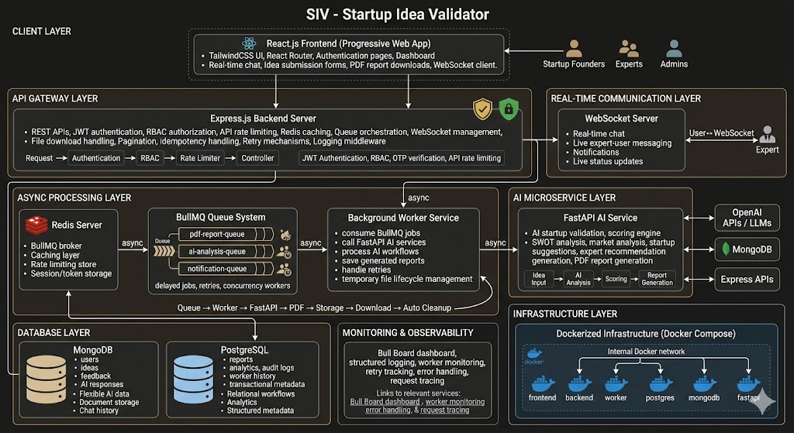
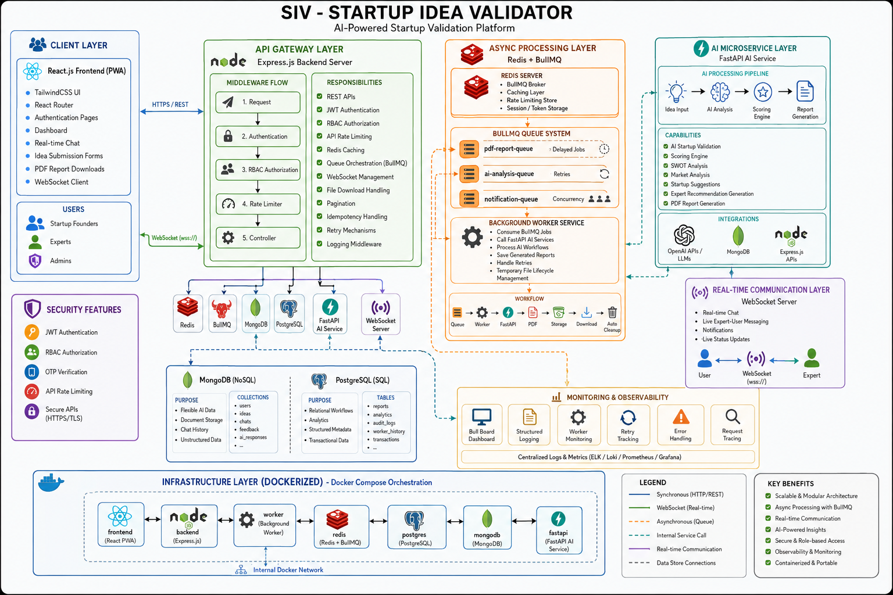

# 🚀 AI-Powered Startup Validator (SIV)

**AI-Powered Startup Validator** is a platform designed to help entrepreneurs validate their startup ideas efficiently. It combines an **interactive AI agent**, **data-driven validation**, and **real-time chat to guide founders** in improving their problem statements, solutions, target markets, teams, and business models. Users can submit their ideas and receive instant feedback and scoring, while experts provide deeper analysis, suggestions, and mentorship.

**Three-Tier Client-Server Architecture with AI Integration**

**software development lifecycle (SDLC) with an Agile/Iterative approach**

**Redis cache memory**

**Design patterns - IdempotencyKey , Pagination**

**Data Flow Example:**
- User submits idea → Backend validates → AI generates score → Stored in DB → User sees result.
- Expert reviews idea → Provides feedback → Stored in DB → User notified.


### Production-Grade AI Startup Evaluation Platform

> A scalable AI-powered startup validation platform built with distributed backend architecture, asynchronous AI workflows, real-time collaboration, and production-level infrastructure engineering.

---

# 🌟 Overview

**AI-Powered Startup Validator (SIV)** is a full-stack AI platform designed to help entrepreneurs validate startup ideas using:

* AI-driven evaluation
* expert feedback systems
* asynchronous report generation
* real-time communication
* scalable backend orchestration

The platform combines:

* **distributed systems architecture**
* **AI microservices**
* **real-time collaboration**
* **queue-driven workflows**
* **production-grade backend engineering**

to deliver intelligent startup analysis and mentorship.

---

# 🏗️ System Architecture

```text
React Frontend (PWA)
        │
        ▼
Express.js API Gateway
        │
 ┌──────┴──────┐_____________________
 ▼             ▼                     |
Redis Cache    BullMQ Queue          ▼ 
                    │              mongodb    
                    ▼         (user,Expert,Admin)
            Background Workers
                    │
                    ▼
          FastAPI AI Microservice
                    │
     ┌──────────────┴──────────────┐
     ▼                             ▼
OpenAI / AI Models          PDF Generation
     ▼
PineConeDB
```

---

# ⚡ Key Engineering Highlights

## ✅ Distributed Backend Architecture

* Multi-service backend architecture
* API Gateway pattern
* Queue-based asynchronous workflows
* AI microservice separation using FastAPI

---

## ✅ Asynchronous AI Processing

* Redis-backed BullMQ task queues
* Background workers for AI report generation
* Retry mechanisms with exponential backoff
* Concurrent worker processing

---

## ✅ Real-Time Communication

* WebSocket-powered chatbot system
* Real-time expert-user communication
* Live notifications and updates

---

## ✅ Scalable AI Report Generation

* AI-powered startup evaluation pipelines
* Dynamic PDF report generation
* Queue-driven processing
* Temporary file lifecycle management
* Auto-cleanup after download

---

## ✅ Production-Grade Backend Features

* JWT Authentication
* Role-Based Access Control (RBAC)
* Redis caching
* API rate limiting
* Pagination
* Idempotency patterns
* Retry & fallback mechanisms
* Structured error handling

---

## ✅ Infrastructure & DevOps

* Dockerized services
* Docker Compose orchestration
* Redis containerization
* PostgreSQL containerization
* Environment-based configuration

---

# 🧠 AI Features

## AI Evaluation Engine

The AI engine analyzes:

* problem statement clarity
* market potential
* business feasibility
* monetization strategies
* scalability
* uniqueness
* execution risks

---

## AI Report Generation

Generates intelligent startup evaluation reports including:

* validation scores
* SWOT analysis
* risk analysis
* market insights
* improvement suggestions
* expert recommendations

---

# 👥 User Roles

## 👤 User

* Submit startup ideas
* Receive AI evaluation reports
* Chat with experts
* View submission history
* Download AI-generated reports

---

## 🧑‍💼 Expert

* Review startup ideas
* Provide expert feedback
* Real-time mentoring
* Score startup concepts
* Participate in discussions

---

## 🛡️ Admin

* Manage users & experts
* Monitor platform activity
* Handle moderation
* System management

---

# 🔐 Security Features

* JWT Authentication
* Password hashing
* OTP-based password reset
* Role-based authorization
* Protected API routes
* API rate limiting
* Secure session handling

---

# ⚙️ Technology Stack

## Frontend

* React.js
* TailwindCSS
* React Router
* WebSockets
* Progressive Web App (PWA)

---

## Backend

### Node.js / Express.js

* API Gateway
* Authentication
* Queue orchestration
* WebSocket server

### FastAPI

* AI processing service
* PDF generation
* AI orchestration

---

## Databases

### MongoDB

Used for:

* ideas
* chats
* AI responses
* flexible documents

### PostgreSQL

Used for:

* report metadata
* analytics
* transactional workflows
* audit logs

---

## Infrastructure

* Redis
* BullMQ
* Docker
* Docker Compose

---

# 🔄 Asynchronous Workflow

## AI Report Pipeline

```text
User Request
      ▼
Express API
      ▼
BullMQ Queue
      ▼
Redis Broker
      ▼
Worker Service
      ▼
FastAPI AI Service
      ▼
PDF Generation
      ▼
Temporary Storage
      ▼
Client Download
      ▼
Auto Cleanup
```

---

# 📊 Monitoring & Observability

* Bull Board queue monitoring
* Structured logging
* Retry tracking
* Worker lifecycle monitoring
* Error tracing

---

# 🚀 Performance Optimizations

* Redis caching layer
* Background processing
* Async task execution
* Worker concurrency
* Queue-based orchestration
* Rate limiting
* Optimized API flows

---

# 📦 Design Patterns & Concepts Used

* Three-Tier Architecture
* API Gateway Pattern
* Microservice Architecture
* Queue-Based Processing
* Repository Pattern
* Idempotency Pattern
* Pagination Pattern
* Retry Pattern
* RBAC Authorization Pattern

---

# 🧪 Engineering Concepts Demonstrated

* Distributed Systems
* Backend Scalability
* Async Processing
* Queue Orchestration
* Worker Systems
* AI Infrastructure
* Real-Time Systems
* Containerized Deployment
* API Security
* Fault Tolerance

---

# 📱 Progressive Web App (PWA)

* Installable application
* Responsive design
* Mobile-friendly UI
* Optimized frontend performance

---

# 🎯 Why This Project Is Significant

SIV goes beyond a traditional CRUD or AI demo project by demonstrating:

* production-grade backend engineering
* distributed async workflows
* scalable AI orchestration
* microservice communication
* real-time systems
* infrastructure-level thinking

The platform simulates real-world SaaS and AI infrastructure patterns used in scalable modern applications.

---

# 🚀 Future Enhancements

* Kubernetes deployment
* AI agent orchestration
* Vector database integration
* Semantic startup search
* Multi-agent AI workflows
* CI/CD pipelines
* Cloud-native deployment
* AI analytics dashboards

---

# 📜 License

This project is licensed under the MIT License.
